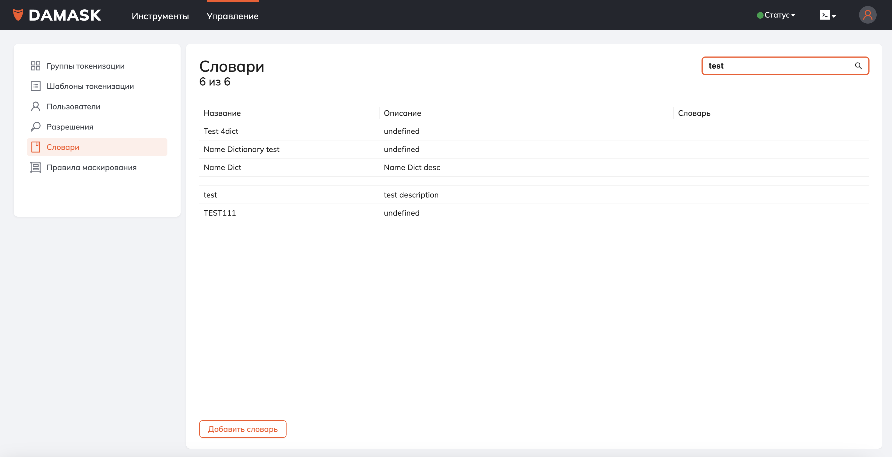

## Руководство пользователя системы DAMASK

DAMASK это Средство Защиты Информации реализованное в формате доверенного высокопроизводительного программно-аппаратного комплекса (ДПАК), использующего метод динамической подмены данных (ДПД) для обеспечения безопасной обработки конфиденциальной данных в различных сценариях.
Система DAMASK является аппаратно программным комплексом, для его управления создан пользовательский интерфейс, доступный через веб-браузер и через CLI (Command Line Interface).

---


### Концепции
#### Обзор сервиса

Метод динамической подмены данных реализован в DAMASK как набор функций REST API, которые затем используется в прикладных решениях таких как драйвер для работы с базами данных через jdbc, сервис защиты информации для систем построения отчетов, расширение ORP Prisma для автоматической  подмены чувствительных данных. Перечень прикладных решений может расширяться, кроме того DAMASK может быть интегрирован в любое приложение с целью о обеспечения безопасной обработки конфиденциальных данных.


### Основные понятия 

1. Токенизация - процесс замены данных на имперсонированный токен.
2. Детокенизация - процесс замены данных токенов на исходные значения.
3. Группа токенизации - определение правил и разрешений замены данных в DAMASK. Сопоставление шаблона токенизации, пользолвателей, разрешений в DAMASK и правил маскирования данных для процесса детокенизации.
4. Шаблон токенизации - шаблон определяющий формата токена.
5. Словарь - набор данных, который используется для маскирования данных при детокенизации.
6. Правила маскирования - набор правил маскирования данных, которые определяются как набор правил алгоритмов маскирования данных для разных объектов маскирования.

### Веб-интерфейс

Один из способов администрирования DAMASK это веб-интерфейс, приложение должно быть доступно по адресу `http://<url DAMASK клиента>`.

Логин/пароль по умолчанию  -  admin/admin. Администратор должен сменить пароль пользователя при первом входе.


Весь интерфейс построен на общих принципах.
В списках сущностей вы можете осуществлять поиск, фильтрацию по содержимому колонок, сортировку содержимого таблицы. Для добавления элемента нужна нажать на кнопку "Добавить", для изменения - нажать на строку, которую хотите отредактировать.

![Поиск]_user_guide_src/search.png "Поиск")


#### Инструменты
##### Токенизация
В интерфейсе пользователя есть отдельный интерфейс для выполнения процесса токенизации. Вход в интерфейс токенизации доступен в меню "Инструменты" - "Токенизация". Для выполнения, необходимо заполнить `json` данными, которые необходимо токенизировать и нажать на кнопку "Токенизацировать". В окне "Результат" отображаются токены.


##### Детокенизация
В интерфейсе пользователя есть отдельный интерфейс для выполнения процесса детокенизации. Вход в интерфейс детокенизации доступен в меню "Инструменты" - "Детокенизация". Для выполнения, необходимо заполнить `json` данными, которые необходимо детокенизировать и нажать на кнопку "Детокенизацировать". В окне "Результат" отображаются детокенизированные данные.


##### Группы токенизации

Для управления группами токенизации необходимо обладать правами администратора. Просмотр списка групп токенизации доступен в меню "Инструменты" - "Группы токенизации".


#### Управление
##### Управление пользователями

Для управления пользователями необходимо обладать правами администратора. Просмотр списка пользователей доступен в меню "Управление" - "Пользователи".


##### Управление правилами маскирования

Для управления правилами маскирования необходимо обладать правами администратора. Просмотр списка правил маскирования доступен в меню "Управление" - "Правила маскирования".


Правила маскирования - это сложный объект, в нем есть вкладка "Схемы маскирования", в которые вы можете определить правила для определенных объектов токенизации. Существует 2 варианта: замена данных на значение из справочника и замена значений на `*`. У каждой схемы есть возможность указать параметры маскирования, например, сохранять длину базовой сущности при маскировании или нет. 


##### Управление словарями

Для управления словарями необходимо обладать правами администратора. Просмотр списка словарей доступен в меню "Управление" - "Словари".



В словаре можно только перезагрузить словарь. Словарь - это текстовой файл из одной колонки.


##### Справочник разрешений

Просмотр списка словарей доступен в меню "Управление" - "Разрешения". Редактирование справочника "Разрешения" недосупно.

#### Мониторинг

Для просмотра информации о состоянии узла кластера можно воспользоваться меню "Статус". Если светофор зеленый, то сервис работает штатно, если красный, то узел недоступен.


Для более детальной информации вы можете перейти в раздел "Мониторинг".


В этом экране вы видите краткую информацию о каждом узле кластера.
Для получение графической информации об основных метриках узла нужно нажать на ссылку "Детализация", для определенного узла.


### Описание работы с CLI DAMASK

#### Установка CLI

Для доступа в CLI из консоли необходимо выполнить следующую команду:
`curl -ssl https://<url DAMASK>/cli/install.sh | bash`.
Существует возможность работы в CLI через веб-интерфейс.


#### Вход в CLI

Для входа в режим CLI необходимо в командной строке выполнить команду `damask`.

```sh
bash$ damask <url сервиса damask>
damask>
```

Для инициализации  сессии работы с damask выполнить команду `init`. В процессе инициализации необходимо ввести логин и пароль пользователя, с привилегиями которого будет выполня будет выполняться работа в CLI.

```sh
bash$ damask <url сервиса damask>
damask> init
login: admin
password: password
damask[admin]>
```
#### Структура команд

Базовый принцип работы с системой определяется общими командами с указанием сущности, к которой они применяются. В случае, если нужно менять параметры определенной сущности, CLI переходит в режим правки данной сущности с последующим сохранением изменений.


**Перечень объектов системы:**
- Пользователи (системное имя - `user`)
- Разрешения (системное имя - `permission`)
- Группы токенизации (системное имя - `token_group`)
- Правила маскирования (системное имя - `masking_rule`)
- Словари (системное имя - `dictionary`)
- Кластер (системное имя - `cluster`)

**Примеры команд:**
- Просмотр всех объектов системы: `show <название объекта системы во множественном числе>`
 ```sh
damask[admin]>show users 
id,name
8ccda60e-0492-4270-920f-5c11c0242da8 Иванов Иван
9ccda60e-0492-4270-920f-5c11c0242da8 Петров Петр
damask[admin]>
```
- Просмотр определенного объекта системы: `show <название объекта системы> <идентификатор объекта>`
 ```sh
damask[admin]>show user ivanov
name: Иванов Иван
display_name: Иванов Иван
description: -
username: ivanov
roles: role1,role2
damask[admin]>
```
- Режим изменений/добавления определенного объекта системы: `<название объекта системы> <идентификатор объекта>`. В случае если идентификатор обекта найден, то система переходит в режим редактирования, в противном случае система переходт в режим добавления элемента.
 ```sh
damask[admin]>user ivanov
User does not exist. Addition.
damask[admin]/user/ivanov>?
name, display_name, description, username, add role, delete role, save, exit
damask[admin]/user/ivanov>name Иванов Иван Иванович
damask[admin]/user/ivanov>display_name Иванов Иван
damask[admin]/user/ivanov>add role role1
damask[admin]/user/ivanov>add role role2
damask[admin]/user/ivanov>add role role3
damask[admin]/user/ivanov>delete role role3
damask[admin]/user/ivanov>save
name: Иванов Иван Иванович
display_name: Иванов Иван
description: -
username: ivanov
roles: role1,role2
Confirm (yes/no):yes
Done
damask[admin]/user/ivanov>exit
damask[admin]>
```

- Удаление определенного объекта системы: `delete <название объекта системы> <идентификатор объекта>`
 ```sh
damask[admin]>delete user ivanov
Confirm (yes/no):yes
Done
damask[admin]>
```
Более сложные комманды будут описаны в разделах ниже

#### Токенизация и детокенизация

- **Переход на уровень токенизации**: 
Для входа в режим токенизации нужно выполнить команду  `tokenize`, указав группу токенизации. 
```sh
damask[admin]>tokenize group <название группы токенизации>
damask[admin]/tokenize>
```
После завершения конфигурирования можно выполнять токенизацию, для этого нужно ввести  команду `tokenize` и строку, которую необходимо токенизировать.

 ```sh
damask[admin]/tokenize>tokenize string1
be2a4487-490e-40e5-b482-fbd2337ee73d
damask[admin]/tokenize>
```

Для целей однократной токенизации нужно ввести сразу группу и объект токенизации, в этом случае переход в режим токенизации производиться не будет. 
 ```sh
damask[admin]>tokenize group <название группы токенизации> string1
be2a4487-490e-40e5-b482-fbd2337ee73d
damask[admin]>

```
- **Переход на уровень детокенизации**: 
Для входа в режим детокенизации нужно выполнить команду  `detokenize`, указав группу токенизации и, опционально,  объект детокенизации. 

 ```sh
damask[admin]>detokenize <название группы токенизации> <объект>
damask[admin]/detokenize>
```
После завершения конфигурирования можно выполнять детокенизации, для этого нужно ввести команду `detokenize` и токен, который необходимо детокенизировать.

 ```sh
damask[admin]/detokenize>detokenize be2a4487-490e-40e5-b482-fbd2337ee73d
string1
damask[admin]/detokenize>
```
Для целей однократной детокенизации нужно ввести сразу группу и объект детокенизации, в этом случае переход в режим детокенизации производиться не будет. 
 ```sh
damask[admin]>detokenize group <название группы токенизации> be2a4487-490e-40e5-b482-fbd2337ee73d 

string1
damask[admin]>
```

####  Управления пользователями


  - **Создание пользователя**: `user <username>`
    - Параметры:
      - `name: <имя>`
      - `display_name: <Отображаемое имя>`
      - `description: <Описание>`
      - `username: <имя пользователя>`
      - `password: <пароль>`
      - `roles: role1,role2`
    
  - **Удаление пользователя**: `delete user <username>`
  - **Смена пароля**: `passwd user <username>`
  - **Изменение пользователя**: `user <username>`
    - Параметры:
      - `name: <имя>`
      - `display_name: <Отображаемое имя>`
      - `description: <Описание>`
      - `password: <пароль>`
      - `roles: role1,role2`
  - **Просмотр информации о пользователе**: `show user <username>`
  - **Список всех пользователей**: `show users`


```sh
damask[admin]> show user
Иванов
Петров
...

damask[admin]>show user ivanov
name: Иванов Иван
display_name: Иванов Иван
description: -
username: ivanov
roles: role1,role2
damask[admin]>delete user ivanov
Подтвердите удаление?(да/нет):да
Сделано

damask[admin]>user ivanov
User exists. Modification.
damask[admin]/user/ivanov>?
name, display_name, description, username, add role, delete role, save, exit
damask[admin]/user/ivanov>name Иванов Иван Иванович
damask[admin]/user/ivanov>display_name Иванов Иван
damask[admin]/user/ivanov>add role role1
damask[admin]/user/ivanov>add role role2
damask[admin]/user/ivanov>add role role3
damask[admin]/user/ivanov>delete role role3
damask[admin]/user/ivanov>save
name: Иванов Иван Иванович
display_name: Иванов Иван
description: -
username: ivanov
roles: role1,role2
Подтвердите изменение? (да/нет):да
damask[admin]/user/ivanov>exit
damask[admin]>
```

####  Управления группами токенизации

  - **Создание группы токенизации**: `token_group <name>`
    - Параметры:
      - `name: <Название>`
      - `description: <Описание>`
      - `template: <Шаблон по умолчанию>`
  - **Добавление разрешений для группы токенизации**: `token_group_permission <name>`
    - Параметры:
      - `username: <username>`
      - `tokenize: false`
      - `detokenize: true`
      - `show: true`
      - `masking_rule: default`
 - **Удаление разрешения для группы токенизации**: `delete token_group_permission <name> <username>`
 - **Просмотр разрешений для группы токенизации**: `show token_group_permissions <name> `
  - **Удаление группы токенизации**: `delete token_group <name>`
  - **Изменение группы токенизации**: `token_group <name>`
    - Параметры:
      - `name: <Название>`
      - `description: <Описание>`
      - `template: <Шаблон по умолчанию>`
  - **Просмотр информации о группе токенизации**: `show token_group <name>`
  - **Список всех групп токенизации**: `show token_groups`


```sh
damask[admin]> show token_group 
group1
group2
...

damask[admin]> show token_group group1
name: group1
description: -
template: guid

damask[admin]> delete token_group group1
Подтвердите удаление?(да/нет):да
Сделано
damask[admin]> token_group group1 
damask[admin]/token_group>description Описание
damask[admin]/token_group>save
Подтвердите изменение?(да/нет):да
Сделано
damask[admin]>
```
#### Управления разрешениями
На данном уровне возможен только просмотр справочника

  - **Список всех разрешений**: `show permissions`
  - **Просмотр информации о разрешении**: `show permission <name>`
```sh
damask[admin]> show permission 
permission1
permission2
...
damask[admin]> show permission permission1
name: permission1
description: -
```
#### Уровень управления словарями

  - **Создание словаря**: `dictionary <name>`
    - Параметры:
      - `name: <Название>`
      - `description: <Описание>`
  - **Просмотр словаря**: `load dictionary <name>`
  - **Загрузка словаря**: `upload dictionary <name>`
    - Параметры:
      - `path: <путь к файлу>`
  - **Удаление словаря**: `delete dictionary <name>`
  - **Просмотр информации о словаре**: `show dictionary <name>`
  - **Список всех словарей**: `show dictionaries`
```sh
damask[admin]> show dictionary
dictionary1
dictionary2
...
damask[admin]> load dictionary fio
Иванов Иван Иванович
Петров Петр Петрович
...
damask[admin]> upload dictionary fio /home/usr/fio.csv

damask[admin]> 
```
#### Уровень управления правилами маскирования

  - **Создание правила маскирования**:  `masking_rule <name>`
    - Параметры:
      - `name: <Название>`
      - `description: <Описание>`
  - **Добавление схемы маскирования для правила маскирования**: `scheme_masking_rule <name>`
    - Параметры:
      - `object: <object>`
      - `type(default/dictionary/no_masking): <тип>`
      - `dictionary:  <словарь>`
      - `params: {param1:"param1",param2:"param2"}`
 - **Удаление схемы маскирования для правила маскирования**: `delete scheme_masking_rule <name> <object>`
 - **Просмотр схемы маскирования для правила маскирования**: `show scheme_masking_rule <name>`
  - **Удаление правила маскирования**: `delete masking_rule <name>`
  - **Изменение правила маскирования**: `masking_rule <name>`
    - Параметры:
      - `name: <Название>`
      - `description: <Описание>`
  - **Просмотр информации о правиле маскирования**: `show masking_rule <name>`
  - **Список всех правил маскирования**: `show masking_rules`

```sh
damask[admin]> show masking_rule
masking_rule1
masking_rule2
...
damask[admin]> show  masking_rule masking_rule1
name: masking_rule1
description: -
damask[admin]> scheme_masking_rule masking_rule1
damask[admin]/scheme_masking_rule> object  name
damask[admin]/scheme_masking_rule> type dictionary
damask[admin]/scheme_masking_rule> dictionary fio
damask[admin]/token_group>save
Confirm (yes/no):yes
Done
damask[admin]>
```

#### Уровень работы с кластером

  - **Список всех серверов**: `show cluster`
  - **Просмотр информации о серверах**: `show cluster <name>`
  - **Переход кластера в режим seal**: `seal`
  - **Переход кластера в режим unseal**: `unseal`
  - **Настройка бекапирования**: `backup <периодичность запуска в стиле cron> <path>`
  - **Просмотр бекапов**: `show backup`
  - **Восстановление из бекапа**: `restore <path>`
  
```sh
damask[admin]> show cluster
server1
server22
...
damask[admin]> backup show
/usr/backup/base240101000000.bak
/usr/backup/base240102000000.bak
/usr/backup/base240103000000.bak
...
damask[admin]> backup '00 19 * * *' /usr/backup
Настройка создания бекапов обновлена.
damask[admin]> restore /usr/backup/base240104000000.bak
File is not found.
damask[admin]> restore /usr/backup/base240101000000.bak
15%
Done.
damask[admin]>
```

#### Общие команды

- **Помощь**: `help [command]` – вывод справочной информации по командам.
- **Версия**: `version` – вывод версии CLI.
- **Выход, переход на уровень выше**: `exit` – вывод версии CLI.

